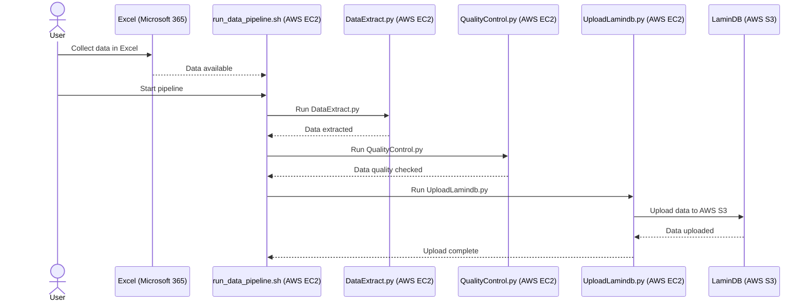

# data_pipeline

## Project Overview
This project provides a data processing pipeline that uses various scripts and tools to download, process and import to lamindb. The pipeline includes steps from data download to quality control and final data storage.

## Directory Structure
```bash
.
├── R
│ ├── convertAnn.R
│ └── scfetch
├── bash
│ ├── download_xlsx.sh
│ └── run_data_pipeline.sh
├── python
│ ├── 1-qc.py
│ └── 2-lamindb-aws.py
└── run_data_pipeline.sh
```


## Dependencies
- Conda
- docker
- scfetch
- LaminDB
- R 
- Python
- ...

## Installation Steps

1. **Clone the repository:**

    ```bash
    git clone https://github.com/Kang-chen/data_pipeline
    cd data_pipeline
    ```

2. **Install necessary dependencies:**

    **_TODO_**

3. **Ensure Docker and Conda environments are properly configured:**

    - Docker
    - Conda

## Usage Instructions

To execute the data processing pipeline, run the following command:

```bash
bash -i ../run_data_pipeline.sh GSE161382
bash -i ../run_data_pipeline.sh GSE161382 3
```
### Option Explanation
GSE161382 is the source_id parameter, representing the dataset to be processed.
3 is the start_step parameter, indicating that the pipeline should start from step 3. If omitted, the pipeline will start from step 1 by default.


## Error Handling
If an error occurs during execution, the script will terminate and display an error message in the terminal. You can check the log files or the error output for more detailed information.

## Contributing
Contributions are welcome! Feel free to submit pull requests or report issues to help improve the project.
